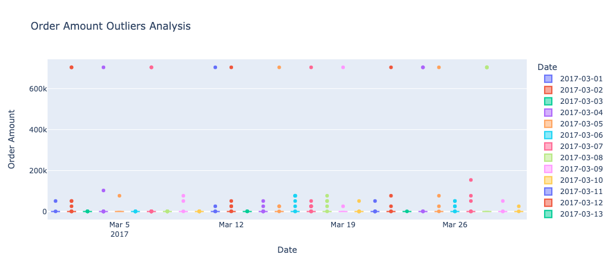

# Shopify Data Science Challenge

*[Person Holding Nike Sb Suede Low-top Sneaker by Ray Piedra](https://www.pexels.com/photo/person-holding-nike-sb-suede-low-top-sneaker-1503009/) | [Pexels Licensed](https://www.pexels.com/license/)*

# Challenge Description

## Part 1 - Analysis
On Shopify, we have exactly 100 sneaker shops, and each of these shops sells only one model of shoe. We want to do some analysis of the average order value (AOV). When we look at orders data over a 30 day window, we naively calculate an AOV of $3145.13. Given that we know these shops are selling sneakers, a relatively affordable item, something seems wrong with our analysis. 

1. Think about what could be going wrong with our calculation. Think about a better way to evaluate this data. 
2. What metric would you report for this dataset?
3. What is its value?

## Part 2 - Queries

For this question you’ll need to use SQL. Follow this [link](https://www.w3schools.com/SQL/TRYSQL.ASP?FILENAME=TRYSQL_SELECT_ALL) to access the data set required for the challenge. Please use queries to answer the following questions. Paste your queries along with your final numerical answers below.

1. How many orders were shipped by Speedy Express in total?
2. What is the last name of the employee with the most orders?
3. What product was ordered the most by customers in Germany?

## Code and Requirements

1. For part 1, refer to `analysis.ipynb` which also requires pandas, plotly express and pathlib libraries to run.
2. For part 2, refer to `queries.sql`

# Summary Analysis - Part 1

## Question 1 - Think about what could be going wrong with our calculation. Think about a better way to evaluate this data.

In the dataset provided, there are 17 extreme outlier observations with a value of 2000. A better way to evaluate this data is to remove the extreme outliers as demonstrated in the boxplots below. However, please note only 12 extreme outliers are observed in the boxplots because there are 5 duplicate extreme outlier orders throughout the 30-day period. Please refer to the `Total Outliers Table` screenshot below. Duplicate orders are highlighted in red.

## Total Items Outliers Analysis

## Total Amount Outliers Analysis

## Total Outliers Table

## Question 2 - What metric would you report for this dataset?

I would report an outlier-adjusted AOV metric by removing the extreme outliers from the AOV calculation.

## Question 3 - What is its value?

The outlier-adjusted AOV metric is $754.09 compared to the naive AOV of $3145.13.

# Challenge Response - Part 2

SQL queries and answers to the questions are captured in the screenshot below:

